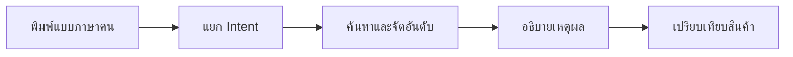
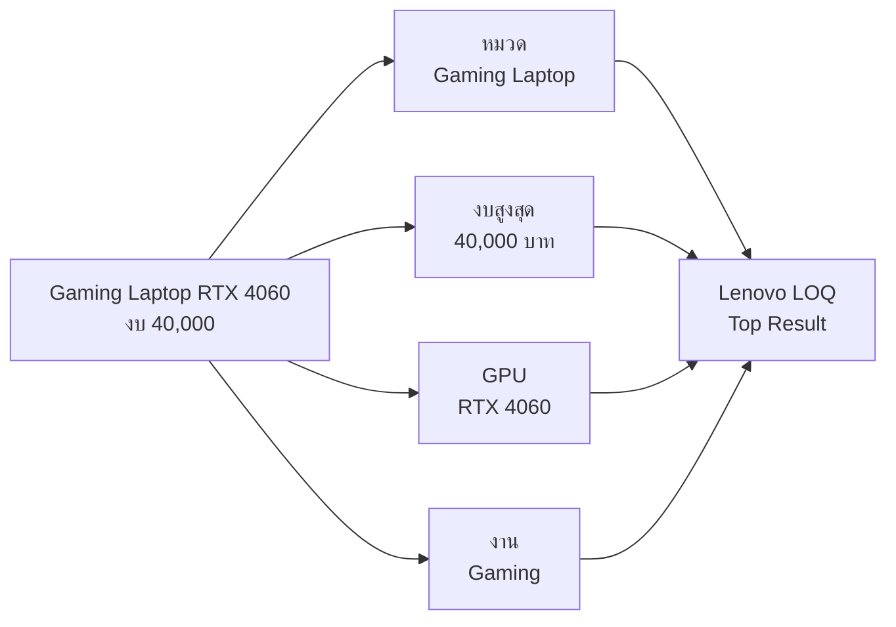
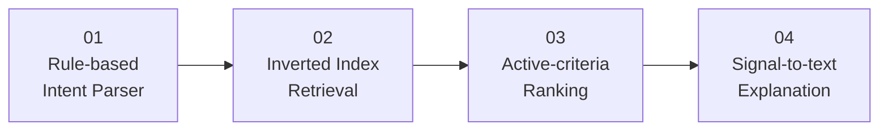
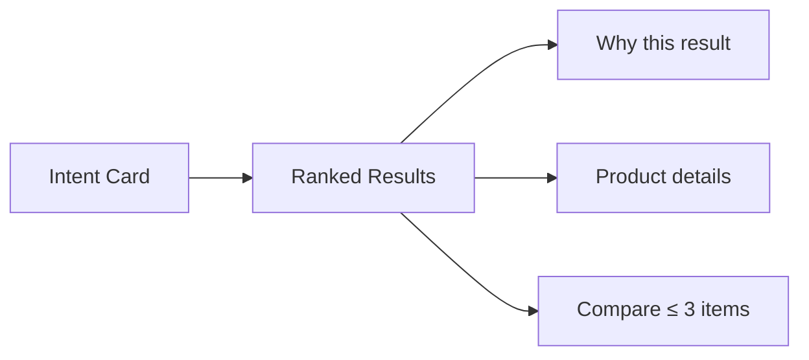
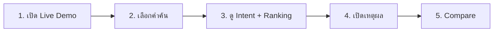

<div align="center">

# ISE

### Intelligent Search Engine for Computer & Technology Products

**Search → Understand → Rank → Explain**

[](https://project-algorithms-prototype-ise.vercel.app/)
[](#prototype-scope)
[](#prototype-scope)
[](#evaluation)

ต้นแบบระบบค้นหาสินค้าไอทีที่เปลี่ยนภาษาธรรมชาติให้เป็นเงื่อนไข<br>
พร้อมจัดอันดับและอธิบายว่าเหตุใดแต่ละผลลัพธ์จึงถูกเลือก

</div>

---

## The idea — ภาพเดียวเข้าใจ




> Match Score คือคะแนนความตรงกับเงื่อนไขที่ผู้ใช้ระบุ ไม่ใช่เปอร์เซ็นต์ความแม่นยำของ AI

---

## From query to result



| INPUT | ENGINE | OUTPUT |
|:--|:--:|--:|
| ภาษาไทย / English | Intent Parser | Structured Query |
| หมวด • งบ • สเปก • งาน | Retrieval + Ranking | Ranked Products |
| สัญญาณคะแนน | Explanation Engine | เหตุผลที่อ่านเข้าใจง่าย |


---

## Core algorithms



| 30% | 25% | 25% | 20% |
|:--:|:--:|:--:|:--:|
| Relevance | Budget | Specifications | Use Case |

```text
Match Score = Σ(active weight × sub-score) ÷ Σ(active weight)
```

เกณฑ์ที่ผู้ใช้ไม่ได้ระบุจะไม่นำมาคำนวณ และระบบจะ normalize น้ำหนักใหม่เฉพาะเกณฑ์ที่ active


[ดูรายละเอียด Algorithm →](docs/ALGORITHM.md)

---

## Explainable interface




| Laptop | Monitor | SSD | Mouse |
|:--:|:--:|:--:|:--:|
| CPU • GPU • RAM | Size • Hz • Panel | Capacity • Interface | Weight • DPI • Battery |

---

## Evaluation

<div align="center">

| Metric @ K=3 | Keyword baseline | **ISE** |
|:--|--:|--:|
| Precision@3 | 0.222 | **0.944** |
| Recall@3 | 0.167 | **0.819** |
| MRR | 0.256 | **1.000** |

```mermaid
xychart-beta
    title "Prototype benchmark — higher is better"
    x-axis ["Precision@3", "Recall@3", "MRR"]
    y-axis "Score" 0 --> 1
    bar [0.222, 0.167, 0.256]
    bar [0.944, 0.819, 1.000]
```

</div>



ผลข้างต้นมาจาก Regression Suite 6 scenarios ของ Prototype เท่านั้น ไม่ได้หมายความว่าระบบแม่นยำ 100% กับทุกคำค้น

[ดู Benchmark และ Ground Truth →](docs/BENCHMARK.md)

---

## Prototype scope

| ✅ CURRENT PROTOTYPE | ◌ FUTURE PROJECT |
|:--|:--|
| Natural-language Search | Semantic Search / ML / LLM |
| Rule-based Thai–English Parser | Typo และภาษาหลากหลายรูปแบบ |
| Ranking + Explanation | Real-time Product API |
| Filter + Compare | Inventory และราคาแบบ Live |
| Responsive Single-page UI | Account, Backend และ Analytics |
| 60 สินค้า • 11 หมวด | Dataset ขนาดใหญ่และอัปเดตอัตโนมัติ |

```text
Prototype goal
└── พิสูจน์ว่า Query → Intent → Ranking → Explanation ทำงานร่วมกันได้
```

> ราคา สเปก และคะแนนความเหมาะสมบางส่วนเป็นข้อมูลสาธิต ไม่ใช่ผลทดสอบฮาร์ดแวร์หรือข้อมูลร้านค้าแบบ Real-time

[Prototype Scope](docs/PROTOTYPE_SCOPE.md) · [Approval Brief](docs/APPROVAL_BRIEF.md) · [Demo Guide](docs/DEMO_GUIDE.md) · [User Test Plan](docs/USER_TEST_PLAN.md)

---

## Quick demo

```text
โน้ตบุ๊กสำหรับเขียนโปรแกรม งบไม่เกิน 30000
Gaming Laptop RTX 4060 ราคาไม่เกิน 40000
จอ 27 นิ้ว 144Hz
SSD 1TB สำหรับ Gaming
เมาส์ทำงาน
```



---

## Run locally

```bash
python -m http.server 8000
```

เปิด `http://localhost:8000`

```bash
node tests/regression.test.js
node tests/demo-scenarios.test.js
```

```text
ISE/
├── index.html              UI และโครงสร้างหน้า
├── style.css               Design system + Responsive
├── script.js               State, Routing, Interaction
├── data/products.js        60 Products / 11 Categories
├── js/engine/              Parser → Retrieval → Ranking → Explain
├── js/benchmark/           IR Evaluation
├── tests/                  Regression + Demo Scenarios
└── docs/                   Project Documentation
```

---

<div align="center">

**NexusTech / ISE**<br>
University Capstone Project Prototype

[Live Demo](https://project-algorithms-prototype-ise.vercel.app/) · [Architecture](docs/ARCHITECTURE.md) · [Project Documentation](docs/PROJECT.md)

</div>
