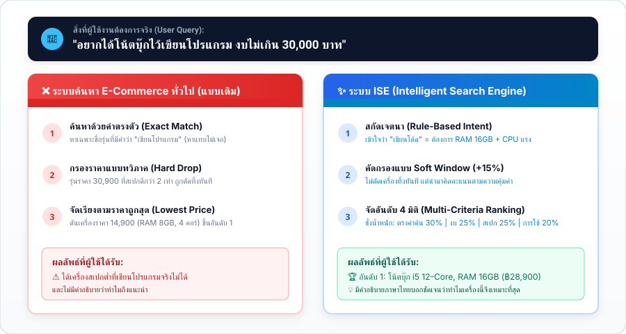
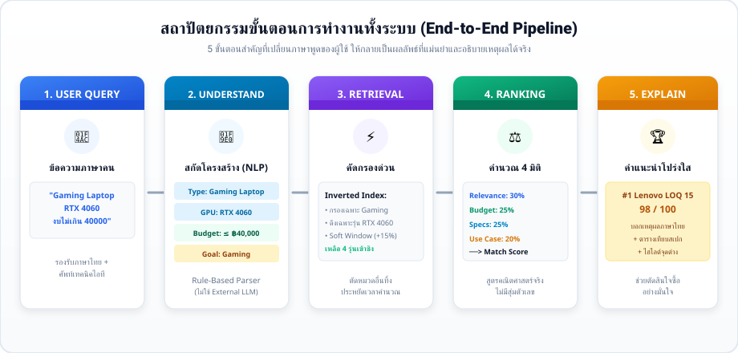
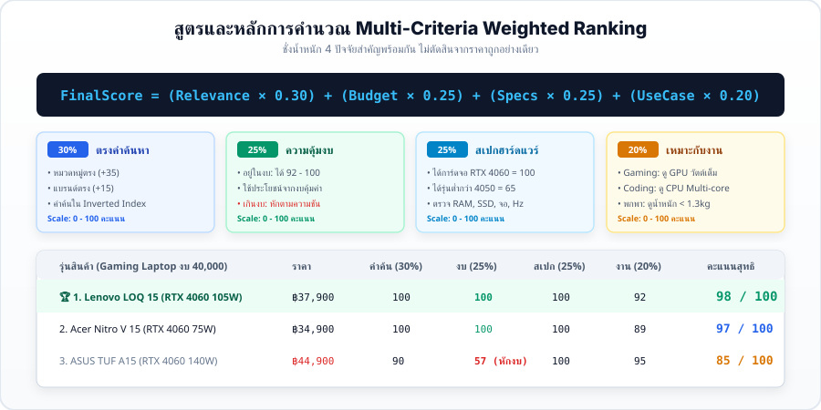

# ISE — Intelligent Search Engine for Computer & Technology Products

> **ระบบค้นหาและจัดอันดับสินค้าคอมพิวเตอร์และไอทีอัจฉริยะ**  
> เข้าใจความต้องการภาษาธรรมชาติ (Natural-Language Requirements) • คัดกรองด้วย Inverted Index • คำนวณคะแนนตัดสินใจด้วย Multi-Criteria Weighted Ranking • อธิบายเหตุผลของคำแนะนำได้อย่างโปร่งใส

[](#)
[](#)
[](#)
[](#)

---

## 1. เข้าใจปัญหาและแนวคิดใน 1 ภาพ (Problem vs. Solution)

เวลาซื้อคอมพิวเตอร์ ผู้ใช้ส่วนใหญ่ไม่ได้จำรหัสโมเดลสินค้าได้ แต่จะบอกความต้องการเป็นภาษาคน เช่น **"อยากได้โน้ตบุ๊กไว้เขียนโปรแกรม งบไม่เกิน 30,000 บาท"**



- **ระบบค้นหาแบบเดิม (Keyword Match):** หาคำตรงตัว ถ้าชื่อสินค้าไม่มีคำว่า *"เขียนโปรแกรม"* จะหาไม่พบ หรือเอาเครื่องราคาถูกสเปกต่ำ 4-Core RAM 8GB มาอยู่อันดับ 1
- **ระบบ ISE:** ตีความว่า "เขียนโปรแกรม" ต้องการ RAM 16GB + CPU Multi-core และจัดอันดับรุ่นที่สเปกคุ้มค่าในงบให้ พร้อมอธิบายเหตุผลภาษาไทย

---

## 2. ขั้นตอนการทำงานทั้งระบบ (End-to-End Pipeline)

ระบบแบ่งการทำงานออกเป็น **5 ขั้นตอนที่เชื่อมโยงกันอย่างเป็นระบบ** ตั้งแต่รับข้อความจนถึงแสดงผลลัพธ์:



| ขั้นตอน | ชื่อขั้นตอน | หน้าที่หลักในระบบ |
| :---: | :--- | :--- |
| **1** | **User Query** | รับข้อความภาษาธรรมชาติภาษาไทยและอังกฤษ เช่น `"Gaming Laptop RTX 4060 งบไม่เกิน 40000"` |
| **2** | **Query Understanding** | สกัดความต้องการออกมาเป็น: `Category`, `Budget Max`, `Hardware Specs`, `Use Case` (ใช้ Rule-Based Parser ไม่ต้องพึ่ง AI Cloud) |
| **3** | **Candidate Retrieval** | ดึงข้อมูลอย่างรวดเร็วผ่าน Inverted Index พร้อมเปิดหน้าต่าง Soft-Budget Window (+15%) ไม่ตัดเครื่องทิ้งทันที |
| **4** | **Multi-Criteria Ranking** | ชั่งน้ำหนักคำนวณคะแนนจริง 4 ด้าน (Relevance 30%, Budget 25%, Specs 25%, Use Case 20%) |
| **5** | **Explain & Present** | อธิบายเหตุผลภาษาไทยว่าทำไมเครื่องนี้จึงเหมาะที่สุด พร้อมตารางเทียบจุดต่างของสเปก |

---

## 3. สูตรและหลักการจัดอันดับ (Multi-Criteria Weighted Ranking)

ISE ไม่ได้ตัดสินว่าสินค้าไหนดีที่สุดจาก "ราคาถูกอย่างเดียว" หรือ "ความดังของแบรนด์" แต่ใช้สูตรคณิตศาสตร์ชั่งน้ำหนัก 4 ปัจจัยพร้อมกัน:



$$\mathbf{FinalScore} = (S_{\text{rel}} \times 0.30) + (S_{\text{bud}} \times 0.25) + (S_{\text{spec}} \times 0.25) + (S_{\text{use}} \times 0.20)$$

### ทำไมระบบนี้ถึงเลือกสินค้าได้ฉลาดกว่า?
- **เครื่องราคา ฿14,900 (RAM 8GB, 4 Cores):** อยู่ในงบแต่สเปกต่ำและไม่เหมาะกับการเขียนโค้ด $\longrightarrow$ **ได้ 72 คะแนน (ตกไปอันดับท้าย)**
- **เครื่องราคา ฿28,900 (RAM 16GB, i5 12 Cores):** ใช้งบคุ้มค่า สเปกสูง เหมาะกับงาน $\longrightarrow$ **ได้ 95 คะแนน (ชนะอันดับ 1 Best Match)**
- **เครื่องราคา ฿44,900 (เกินงบ 40k ไป 12%):** สเปกดีมาก แต่ถูกหักคะแนนส่วนงบประมาณ $\longrightarrow$ **ได้ 85 คะแนน (หล่นไปอยู่อันดับ 4)**

---

## 4. ผลลัพธ์และการอธิบายเหตุผล (Explainable UI)

ผู้ใช้จะไม่เห็นแค่ตัวเลขคะแนนลอยๆ แต่จะเห็นข้อมูลสเปกที่ครบถ้วน พร้อมบทวิเคราะห์เหตุผลภาษาไทย:


- **Interpreted Intent Card:** แสดงชิปสรุปว่าระบบเข้าใจว่าคุณต้องการอะไร
- **Best Match Badge:** ไฮไลต์เครื่องที่ตอบโจทย์ความต้องการสูงสุด
- **Why This Result:** ประโยคภาษาไทยสังเคราะห์จากสัญญาณคะแนนจริง (เช่น ได้การ์ดจอตรงรุ่น, แรมพอ, อยู่ในงบ)
- **Side-by-Side Comparison:** ปุ่มเปิดตารางเปรียบเทียบสเปกได้สูงสุด 3 รุ่น พร้อมปุ่ม **"🔍 ไฮไลต์จุดต่างของสเปก"**

---

## 5. เปรียบเทียบผลการทดสอบ (Empirical Benchmark)

ทดสอบเปรียบเทียบระหว่าง **ระบบค้นหาตามคีย์เวิร์ดเดิม (Baseline)** กับ **ระบบ ISE** ใน 6 สถานการณ์จริง:

```
  มาตรวัดความแม่นยำ (Cutoff Rank K = 3)
  ──────────────────────────────────────────────────────────────────────────
  Precision@3 (ความแม่นยำ 3 อันดับแรก)   :  Baseline 0.222  ──>  ISE 0.944 (+325%)
  Recall@3 (ความครอบคลุมสินค้าที่ตรงจริง) :  Baseline 0.167  ──>  ISE 0.819 (+390%)
  Mean Reciprocal Rank (MRR)          :  Baseline 0.256  ──>  ISE 1.000 (อันดับ 1 ตรงเป้า 100%)
  Search Latency (เวลาประมวลผลเฉลี่ย)  :  2.55 ms บนเบราว์เซอร์
```

> **ความโปร่งใสทางวิชาการ:** การทดสอบนี้รันบน Regression Test Suite 6 สถานการณ์จริง เพื่อยืนยันว่าตรรกะการจัดอันดับทำงานถูกต้องตามสูตรคณิตศาสตร์ ไม่ได้อ้างว่าเป็น AI หรือมีความแม่นยำ 100% กับทุกคำค้นหาในโลก

---

## 6. โครงสร้างโปรเจกต์ (Zero-Build Architecture)

โปรเจกต์นี้เขียนด้วย **Pure Web Standards (HTML5, CSS3, Vanilla ES6 JavaScript)** สามารถเปิดใช้งานได้ทันทีโดยไม่ต้องติดตั้ง Node Modules หรือรัน Build Tools:

```
ISE/
├── index.html                  # หน้าเว็บหลัก Single Page Application
├── style.css                   # ระบบดีไซน์ Responsive, ฟอนต์ Noto Sans Thai
├── script.js                   # ตัวควบคุม State, Router และ Event
│
├── data/
│   └── products.js             # แคตตาล็อกสินค้าไอทีจริง 60+ รายการ (11 หมวดหมู่)
│
├── js/
│   ├── engine/
│   │   ├── queryParser.js      # 🧠 อัลกอริทึมสกัดเจตนา (Rule-Based Intent Parser)
│   │   ├── retrieval.js        # ⚡ อัลกอริทึมค้นหา Inverted Index และกรองตัวเลือก
│   │   ├── ranking.js          # ⚖️ อัลกอริทึม Multi-Criteria Weighted Ranking
│   │   └── explainer.js        # 💬 อัลกอริทึมอธิบายเหตุผลภาษาไทย (Signal-to-Text)
│   └── benchmark/
│       └── benchmark.js        # 📊 ชุดทดสอบวัดค่าทางสถิติ IR Benchmark
│
├── assets/
│   ├── diagrams/               # 🖼️ ภาพอินโฟกราฟิกอธิบายระบบ (SVG)
│   └── placeholders/           # 💻 ภาพเวกเตอร์ประกอบสินค้าไอที (SVG)
│
└── README.md                   # เอกสารฉบับนี้
```

---

## 7. วิธีการเปิดใช้งาน (Quick Start)

### วิธีที่ 1: ดับเบิลคลิกเปิดได้ทันที
- ดับเบิลคลิกที่ไฟล์ `index.html` เพื่อเปิดใช้งานบน Chrome, Edge, Safari หรือ Firefox ได้ทันที

### วิธีที่ 2: รันผ่าน Local Web Server (แนะนำ)
```bash
# ใช้ Python (มีติดเครื่องอยู่แล้ว)
python -m http.server 8000

# หรือใช้ npx serve
npx serve .
```
เปิดเบราว์เซอร์ไปที่: `http://localhost:8000`

### วิธีที่ 3: รันการทดสอบ Benchmark ผ่าน Terminal
```bash
node -e "
const { ISE_PRODUCTS } = require('./data/products.js');
const { ISEQueryParser } = require('./js/engine/queryParser.js');
const { ISERetrievalEngine } = require('./js/engine/retrieval.js');
const { ISERankingEngine } = require('./js/engine/ranking.js');
const { ISEBenchmarkRunner } = require('./js/benchmark/benchmark.js');

const runner = new ISEBenchmarkRunner(ISE_PRODUCTS, ISEQueryParser, new ISERetrievalEngine(ISE_PRODUCTS), new ISERankingEngine());
console.log(runner.evaluate(3).summary);
"
```

---

## 8. สรุปภาพรวมเชิงวิชาการ (Academic Conclusion)

ระบบ **ISE** แสดงให้เห็นว่า การแก้ไขปัญหาการค้นหาและตัดสินใจซื้อสินค้าไอทีที่ซับซ้อน **ไม่จำเป็นต้องใช้โมเดล AI ขนาดใหญ่หรือระบบคลาวด์ที่มีค่าใช้จ่ายสูง** 

แต่สามารถแก้ได้อย่างมีประสิทธิภาพด้วยการประยุกต์ใช้หลักการ **Information Retrieval (IR)**:
1. การแปลงภาษาพูดเป็นโครงสร้างข้อมูลด้วย **Rule-Based Intent Parsing**
2. การคัดกรองตัวเลือกด้วย **Inverted Index + Soft Window**
3. การตัดสินใจหลายมิติด้วย **Multi-Criteria Weighted Ranking**
4. การสร้างความโปร่งใสให้ผู้ใช้ด้วย **Explainable Reasoning**

---
*University Capstone Project Prototype — Brand: NexusTech / ISE*
