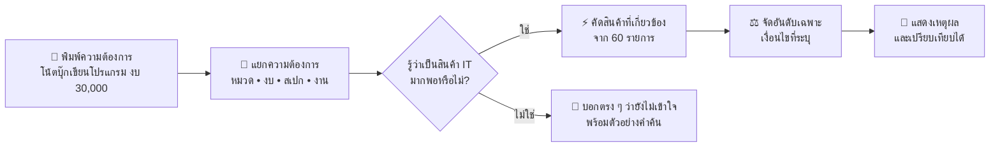
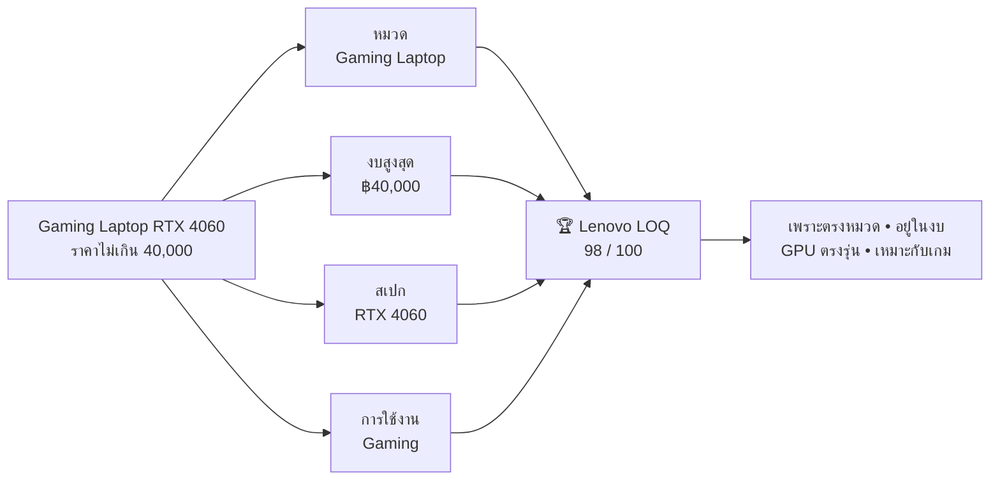
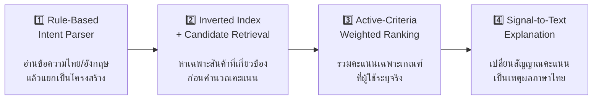
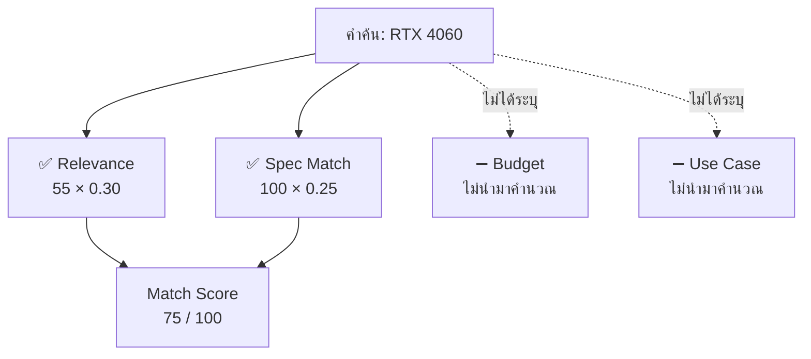
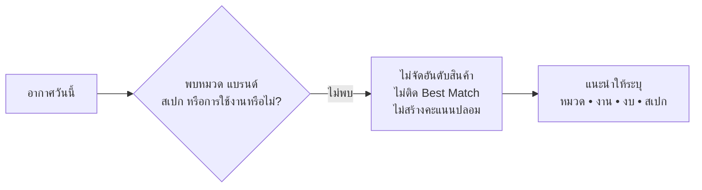
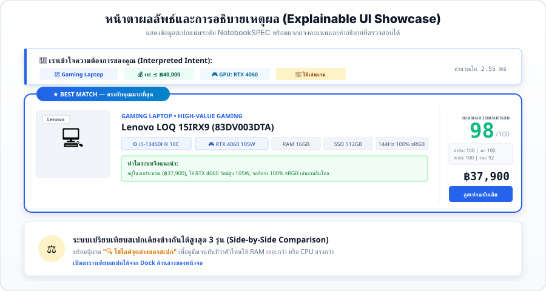
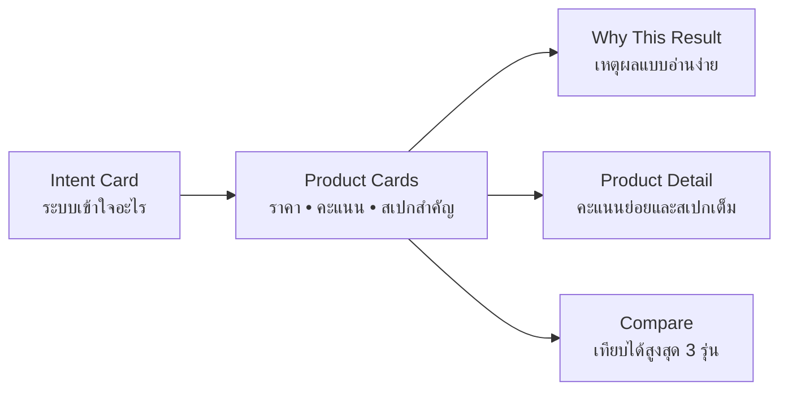
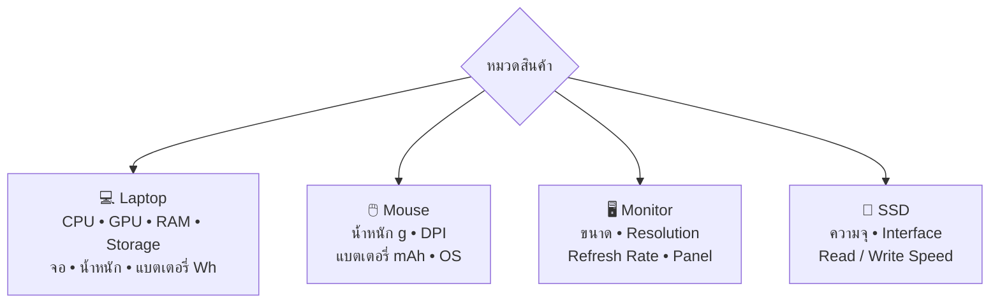
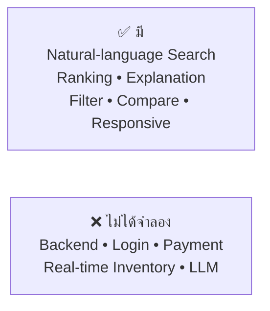

# ISE — Intelligent Search Engine for Computer & Technology Products

> พิมพ์ความต้องการแบบภาษาคน → ระบบเข้าใจเงื่อนไข → จัดอันดับสินค้า → บอกเหตุผลที่ตรวจสอบได้

[](https://project-algorithms-prototype-ise.vercel.app/)
[](https://github.com/mmew018/project-algorithms-prototype-ise)
[](#)
[](#ผลทดสอบแบบสั้น)

## เข้าใจ ISE ใน 30 วินาที



### สิ่งที่ผู้ใช้ได้รับ



> **Match Score คือคะแนนความตรงกับเงื่อนไขที่พิมพ์ ไม่ใช่เปอร์เซ็นต์ความแม่นยำของ AI**

---

## ทำไมไม่ใช้แค่ Keyword Search?

| ค้นหาแบบเดิม | ISE |
|---|---|
| เห็นเพียงคำที่สะกดตรงกัน | แปลงคำค้นเป็นเงื่อนไขที่ระบบใช้ได้ |
| ราคาต่ำอาจขึ้นก่อน แม้ไม่เหมาะกับงาน | ชั่งทั้งความเกี่ยวข้อง งบ สเปก และลักษณะงาน |
| คำค้นไม่เกี่ยวข้องก็อาจยังคืนสินค้า | ยอมบอกว่า “ยังไม่เข้าใจคำค้นนี้” |
| ได้อันดับ แต่ไม่รู้เหตุผล | ทุกผลลัพธ์มีคำอธิบายจากคะแนนจริง |

ตัวอย่างคำค้นที่รองรับ:

- `โน้ตบุ๊กสำหรับเขียนโปรแกรม งบไม่เกิน 30000`
- `Gaming Laptop RTX 4060 ราคาไม่เกิน 40000`
- `จอ 27 นิ้ว 144Hz`
- `SSD 1TB สำหรับ Gaming`
- `เมาส์ทำงาน`

---

## Algorithms ที่ใช้ — ดูภาพเดียวจบ



| Algorithm | ทำหน้าที่อะไร | ทำไมเลือกใช้ตัวนี้ |
|---|---|---|
| **Rule-Based Intent Parsing** | จับหมวดสินค้า แบรนด์ งบ สเปก และการใช้งาน | ผลลัพธ์คงที่ อธิบายง่าย รันใน Browser และเหมาะกับขอบเขต Capstone |
| **Inverted Index** | เชื่อมคำสำคัญกับรายการสินค้าเพื่อดึง Candidate | เร็วกว่าไล่ให้คะแนนสินค้าทุกชิ้น และเป็นหลักการพื้นฐานของ Information Retrieval |
| **Soft Budget Window** | ยอมให้ Candidate เกินงบเล็กน้อยเข้ารอบ แล้วหักคะแนนภายหลัง | ไม่ทิ้งตัวเลือกที่อาจคุ้มกว่าจากเส้นงบแบบตัดทันที |
| **Multi-Criteria Weighted Ranking** | รวมหลายเงื่อนไขเป็น Match Score เดียว | การซื้อสินค้าไอทีไม่มีปัจจัยเดียวที่ตัดสินได้ทั้งหมด |
| **Signal-to-Text Explanation** | สร้างข้อความ “ทำไมผลลัพธ์นี้ตรง” จากสัญญาณจริง | ผู้ใช้ตรวจสอบเหตุผลได้ โดยไม่ต้องเชื่อคะแนนลอย ๆ |

---

## หัวใจของ Ranking: ไม่ให้คะแนนกับสิ่งที่ผู้ใช้ไม่ได้บอก



$$\text{MatchScore}=\operatorname{round}\left(\frac{\sum_{i\in A}w_iS_i}{\sum_{i\in A}w_i}\right)$$

- `A` = เกณฑ์ที่พบในคำค้นจริง
- เกณฑ์ที่ไม่พบ = **ไม่ได้ระบุ** ไม่ใช่ 100 คะแนน
- น้ำหนักตั้งต้น: Relevance `30%` • Budget `25%` • Specs `25%` • Use Case `20%`
- ระบบ normalize น้ำหนักใหม่ทุกครั้งตามเกณฑ์ที่ active

### ประตูความน่าเชื่อถือของคำค้น



<details>
<summary><strong>ดูรายละเอียดคะแนนย่อย</strong></summary>

| คะแนนย่อย | สัญญาณที่ใช้ |
|---|---|
| **Relevance** | หมวด แบรนด์ และคำที่ตรงกับข้อมูลสินค้า |
| **Budget** | อยู่ในงบ ใช้งบคุ้มค่า หรือเกินงบมากน้อยเพียงใด |
| **Specs** | CPU, GPU, RAM, Storage, ขนาดจอ และ Refresh Rate ที่ระบุ |
| **Use Case** | ความเหมาะกับ Programming, Gaming, AI, Productivity หรือ Thin & Light |

รายละเอียดสูตรเต็ม: [`docs/ALGORITHM.md`](docs/ALGORITHM.md)

</details>

---

## จาก Algorithm สู่หน้าจอ





ข้อมูลที่แสดงปรับตามหมวดสินค้า:



---

## ผลทดสอบแบบสั้น

ทดสอบกับ Regression Suite จำนวน 6 สถานการณ์ ที่ตำแหน่งผลลัพธ์ 3 อันดับแรก (`K = 3`)

| Metric | Keyword Baseline | ISE | ความหมายแบบสั้น |
|---|---:|---:|---|
| **Precision@3** | 0.222 | **0.944** | 3 อันดับแรกตรงโจทย์มากขึ้น |
| **Recall@3** | 0.167 | **0.819** | เก็บสินค้าที่เกี่ยวข้องได้ครอบคลุมขึ้น |
| **MRR** | 0.256 | **1.000** | สินค้าที่ตรง Ground Truth ปรากฏอันดับแรกทุก scenario |

> ตัวเลขนี้เป็นผลจากชุดทดสอบของ prototype ไม่ใช่คำกล่าวอ้างว่าระบบแม่นยำ 100% กับทุกคำค้นบนโลก

รายละเอียดชุดทดสอบ: [`docs/BENCHMARK.md`](docs/BENCHMARK.md)

---

## ขอบเขตของ Prototype



ISE เป็น **University Capstone Prototype** ที่เน้นพิสูจน์แนวคิด:

> Search → Understand → Rank → Explain

ระบบใช้ข้อมูลสินค้า local 60 รายการ 11 หมวด ทำงานด้วย HTML, CSS และ Vanilla JavaScript โดยไม่ต้องมี Backend หรือ External AI Service

---

## เปิดใช้งาน

### ใช้เว็บทันที

👉 [project-algorithms-prototype-ise.vercel.app](https://project-algorithms-prototype-ise.vercel.app/)

### รันในเครื่อง

```bash
python -m http.server 8000
```

จากนั้นเปิด `http://localhost:8000`

<details>
<summary><strong>ดูโครงสร้างโปรเจกต์</strong></summary>

```text
ISE/
├── index.html                 # Single-page UI
├── style.css                  # Responsive design
├── script.js                  # State, routing และ interactions
├── data/products.js           # สินค้า 60 รายการ / 11 หมวด
├── js/engine/
│   ├── queryParser.js         # Rule-based intent parser
│   ├── retrieval.js           # Inverted index retrieval
│   ├── ranking.js             # Active-criteria ranking
│   └── explainer.js           # Explainable result text
├── js/benchmark/benchmark.js  # IR regression benchmark
└── docs/                      # เอกสารทางเทคนิคฉบับเต็ม
```

</details>

---

**NexusTech / ISE — University Capstone Project Prototype**
